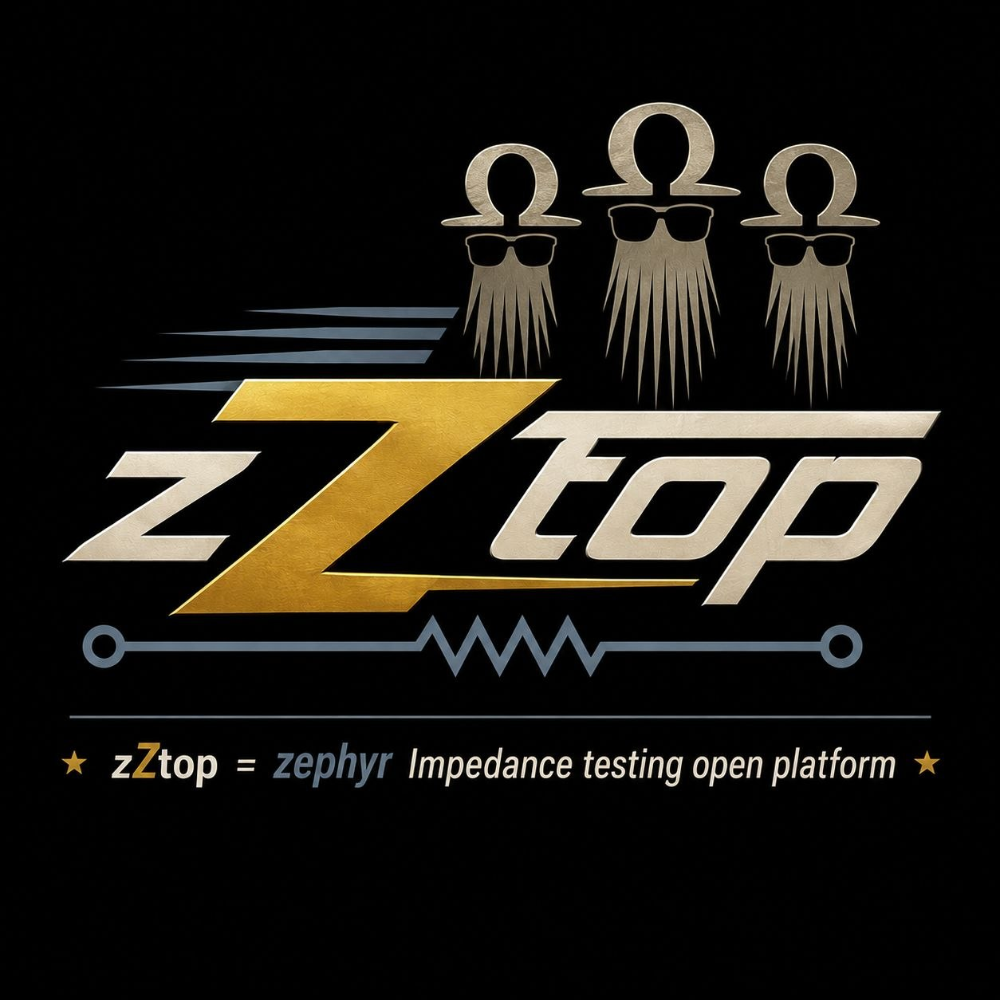

<p align="center">
  
</p>

# zZtop  -  Zephyr Impedance Testing Open Platform

An open-source electrochemical impedance spectroscopy (EIS) / frequency-response-analysis
instrument, built from the ground up toward professional-quality, low-cost, sovereign lab
instrumentation.

> **Experimental.** This is active, early-stage R&D. Expect churn, rebuilds, and the odd dead
> end kept in the history on purpose  -  the paper trail is part of the point. These repos at
> edge-collective are the working notebook; a curated multi-repo ecosystem comes later, once the
> R&D settles.

## What this is

zZtop grows an impedance-measurement instrument in small, cross-validated steps. The digital
measurement engine runs on an Electrosmith Daisy Seed (STM32H750) under Zephyr RTOS  -  coherent
DMA DDS drive plus a streaming software lock-in  -  and already produces swept Nyquist spectra on
test networks.

This repo starts the analog front-end: a minimal **two-probe FRA front-end** whose job is to
decouple the codec's output impedance from the system under test. It goes back to basics  -  the
classic **adder potentiostat** (Bard & Faulkner, *Electrochemical Methods*, Ch. 15): a
potential-control amplifier, a reference voltage-follower, and a current-follower / transimpedance
stage. It picks up the lineage of our own
[olm-pstat](https://github.com/p-v-o-s/olm-pstat) (p-v-o-s, presented at Open Hardware Summit
2013  -  with a schematic contribution from Jack Summers) and the later p-v-o-s 4pstat, simplified
to two electrodes first, before we earn the four-probe version.

## Approach

- Circuits are defined in code with [tscircuit](https://tscircuit.com) (React/TypeScript):
  schematic, PCB, and breadboard render from one source, so the design history is just the git log.
- KiCad + ngspice for rigorous schematic/PCB capture and SPICE validation.
- First-stage prototypes use through-hole DIP parts (the Research phase); later development moves
  to modern SMD (the Development phase).

## Status

Early. The tscircuit scaffold is in place. Next up: the two-probe adder-pstat front-end schematic
and its SPICE model, built around a general-purpose quad op-amp with a JFET-input part on the
current-follower.

## Building

```
npm install       # or: bun install
npx tsci dev      # interactive schematic/PCB/breadboard preview
npx tsci build    # compile and validate
```

## License

Open source; license to be finalized. Hardware and software will be released openly.

---

*Design work on this repository is done with the assistance of an AI agent (Anthropic's Claude),
working under Craig Versek's direction and review.*
