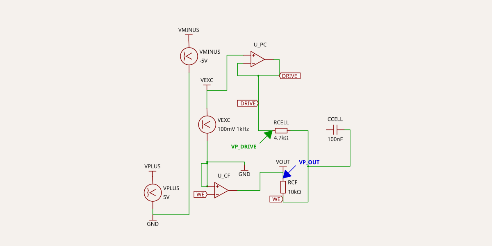
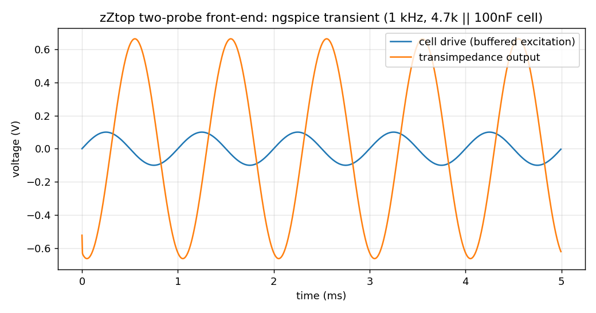

# Two-probe front-end, first pass

This is the first analog stage for zZtop: a minimal two-electrode front-end that
sits between the measurement engine and the cell. Its whole job is to drive the
cell from a low-impedance source and measure the resulting current, so that the
output impedance of the Daisy Seed's PCM3060 audio codec, and the coupling
capacitors on its line outputs, never show up in the answer.

It is the classic adder potentiostat (Bard and Faulkner, Electrochemical Methods,
Ch. 15) cut down to two electrodes. Three amplifier roles in the full version:

    PC  potential control   drives the counter electrode to hold the setpoint
    VF  voltage follower    buffers the reference electrode
    CF  current follower    transimpedance stage at the working electrode

For a two-probe measurement we keep the two that matter, the PC driver and the CF
transimpedance stage, and leave the reference/VF arm for later.

## Topology

    VEXC --> [ PC buffer ] --DRIVE--> ( Rcell || Ccell ) --WE--> [ CF / TIA ] --> VOUT

The PC buffer is a unity-gain follower. It presents a low output impedance to the
cell, so whatever the excitation source looks like upstream, the cell sees a stiff
drive. The CF stage holds the working electrode at virtual ground and converts the
cell current to a voltage through the feedback resistor Rcf, so VOUT = -i * Rcf.

## In code

The circuit is a tscircuit design (`index.circuit.tsx`). Parts, nets, and the SPICE
stimulus all live in the same file, so the schematic, the netlist, and the
simulation come from one source and the history is just the git log. The op-amps
are ideal here; the R||C cell and Rcf are placeholders. The point of this pass is
the topology and the measurement path, not the final part values.

## SPICE check

The same file carries an ngspice transient run: a 0.1 V, 1 kHz sine into a
4.7k || 100nF cell, with Rcf = 10k. Two probes, one at the cell drive node and one
at the transimpedance output.

The drive node holds 0.1 V amplitude exactly, which is the decoupling working: the
buffer reproduces the excitation regardless of the source impedance. The output
amplitude is 0.6633 V.

Checking against theory. At 1 kHz the cell impedance is

    Xc   = 1 / (2*pi*1000*100e-9)       = 1592 ohm
    |Z|  = (4700 * Xc) / hypot(4700,Xc) = 1507 ohm

and the transimpedance output should be

    |VOUT| = (Rcf / |Z|) * Vexc = (10000 / 1507) * 0.1 = 0.663 V

Measured 0.6633 V against 0.663 V predicted. The current measurement is correct
and the front-end does what it is supposed to.

## Next

- Map the ideal op-amps onto real parts: a general-purpose quad for PC/VF/CF and a
  JFET-input single on the current-follower where bias current matters.
- Pull the real Rcf ranges and compensation caps from the olm-pstat schematic.
- Move from a single-frequency transient to a frequency sweep, so the output is a
  Bode/Nyquist rather than one point.
- Footprints, then the breadboard and PCB views.
- Add the differential voltage-sense arm for a ratiometric V/I measurement.
