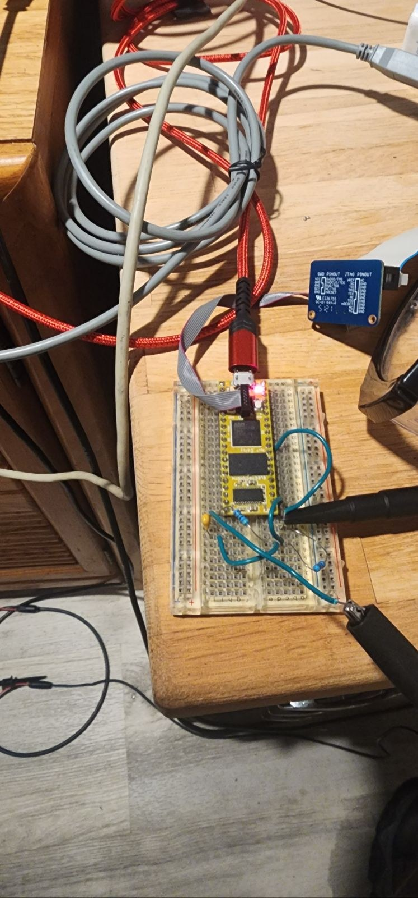
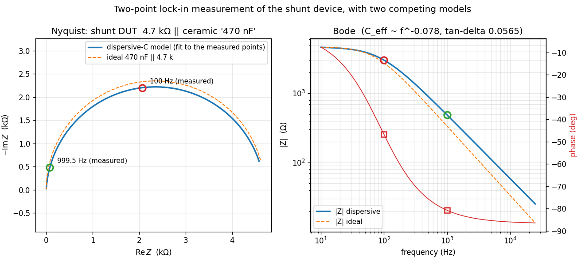

# Applications

Numbered in the order they were developed. Each one is standalone: it carries its own
`prj.conf`, and its own `Kconfig` where a promptless symbol needs selecting. Nothing
here depends on configuration passed at build time.

    01-coherent-dma        non-cacheable memory for coherent buffers with the cache on
    02-dac-dma-tone        timer-triggered DMA to the DAC: the first generated waveform
    03-adc-bringup         acquisition path, proven in two stages
    04-lockin-iq           in-phase and quadrature detection: the lock-in core
    05-lockin-phase-ref    pinning the start phase so absolute phase means something
    06-lockin-two-point    a second frequency, and the first spectroscopy

Any of them can be built and flashed on its own, but they are written to be read in
order: each header comment explains what that application adds to the one before it.

## The shared arrangement

From `03-adc-bringup` onward the applications share one hardware arrangement, described
here rather than repeated in each file.

TIM6 raises an update event at the sample rate. That event does two things at once: it
triggers a DAC conversion, and it triggers an ADC conversion. Excitation and acquisition
therefore advance on the same clock edge, so acquisition sample k corresponds to
excitation update k, and there are exactly as many samples per output period as there
are points in the lookup table.

This is the reason the instrument can measure phase at all. Coherence between output and
input is structural, a consequence of sharing one timer, rather than something calibrated
away afterwards. There is only one clock in the story, so there is nothing to drift.

Both DMA streams, and the debug transport, place their buffers in the board's
non-cacheable region. See [../BUILDING.md](../BUILDING.md) for why that region exists.

## Wiring

The measurement is a loop. The board drives a signal out of its DAC, that signal passes
through whatever is being measured, and the board reads the result back on its ADC. So
two pins have to be connected by something:

    PA4  (pin 30)  DAC1_OUT1   ---- device under test ---->  PC0 (pin 22)  ADC1_INP10
                                                             also labelled A0

For the loopback applications that "device under test" is a plain jumper wire, a direct
short from output to input. That sounds pointless and is not: with the two pins tied
together the answer is known in advance, so any magnitude error or phase offset the
instrument reports is the instrument's own. It is how the residual pipeline delay gets
characterised before anything unknown is put in the path.

For the spectroscopy application the jumper is replaced by the network under test: a
voltage divider with the device of interest in its lower leg.

    PA4 (pin 30) --- R_series 4k7 --- node (pin 22, A0) --- R_shunt 4k7 --- AGND
                                         |                      |
                                         +------ C_dut ---------+

Because the ADC reads the divider node, the raw measurement is a ratio rather than an
impedance. Two equal resistors give a free sanity check: at DC the capacitor is an open
circuit, so the ratio should be exactly 0.5. Recovering the capacitor alone means
inverting the divider for the shunt-leg impedance and then subtracting the known
resistor in admittance, since parallel elements add that way.

The board on its breadboard, debug probe ribbon on the SWD header and USB for power.
The jumpers and the resistor and capacitor to the right of the board are the divider,
wired between the DAC pin and the ADC pin. The two probes are the oscilloscope, watching
the generated waveform directly.

### What two points buy you

The two lock-in measurements, at 999.5 Hz and 100 Hz, plotted against two candidate
models of the shunt device. The dashed curve is an ideal 470 nF capacitor, the nominal
part value. The solid curve is a dispersive model, in which the effective capacitance
falls slowly with frequency and the loss is set by a constant loss tangent.

Both measured points land on the dispersive curve rather than the ideal one. Two
frequencies are enough to see that, which is the entire argument for the second
excitation frequency: a single point could be fitted by either model, and only the
second one separates them.

This figure is produced by the analysis tooling that arrives with the sweep engine
rather than by the firmware itself; the two points on it are the measurements these
applications make.

Everything else on the bench is support: a debug probe on the SWD header for flashing and
trace output, and an oscilloscope probe where the generated waveform needs independent
confirmation.
